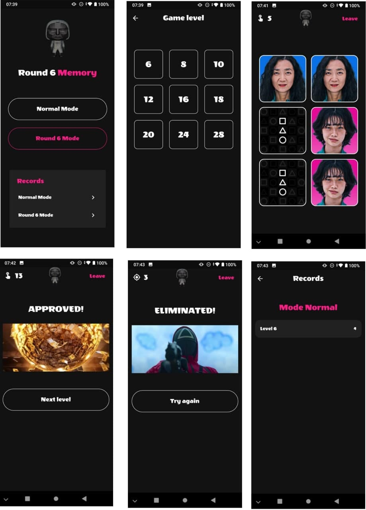

# Flutter Round6 Memory Puzzle

A memory game made in flutter

## Key Points:

Personalized theme.

Animation using Transform to flip the card when it is pressed.

MobX to state managment of the game controlls and database repository.

Provider (and Proxy Provider) to control the instances of game controlls (mobx), and the repository (hive).

Hive database to store and load the records of the user per game category (normal or round6).

This project is a starting point for a Flutter application.

## Source Code:

The source code was provided by Prof. Diego Antunes - [Vídeo Tutorial no Youtube PT-BR](https://www.youtube.com/watch?v=hU8ht030JUM&list=PL_wKlpKIC9vVOZxwQyNzuD1lL9cJgPiiE&ab_channel=Prof.DiegoAntunes)

